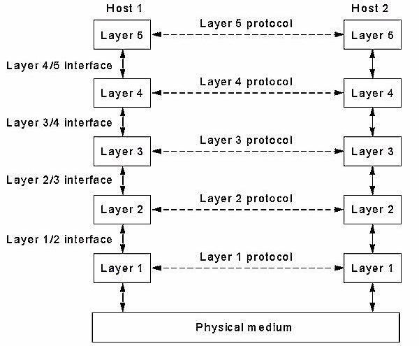
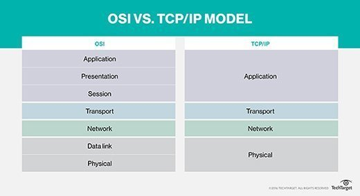

# CS241 Networking lecture 1
*2/10/2018*

### What is a Computer Network?
> An interconnected collection of two or more autonomous computers.

A network can be implemented as a [client-server model](), a popular example is a webserver, or as a [peer-to-peer model](), a popular example being email.

### Classifying Networks
Common ways to classify networks are by:
1. Transmission Technology
1. Scale

**Transmission Technology**

There are two main classifications of transmission technology.
* broadcast links (generally for localised networks)
  * a single, shared communication channel
  * short messages (packets) are recieved by all but are ignored by everyone except the user to which they are addressed
  * This is [multicasting](https://en.wikipedia.org/wiki/Multicast) by appropriate addressing
* point-to-point links (generally for larger networks)
  * connections between individual machines
  * This is [unicasting](https://en.wikipedia.org/wiki/Unicast)
  * routing algorithms required

**Scale**

There are five main classifications of network scale.
* Personal Area Network (PANs)
  * A network that covers a very small area of under a metre squared
  * an example of this would be a short range wireless network such as blutooth
* Local Area Network (LANs)
  * A network that covers anywhere from a room to a campus
  * An example of this would be wifi
* Metropolitan Area Network (MANs)
  * A network that covers a city
  * An example of this would be a cable tv network
* Wide Area Network (WANs)
  * A network that covers anywhere from a country or a continent
  * This is often done by connecting many LANs to a subnet (usually [packet-switched](https://en.wikipedia.org/wiki/Packet_switching)) using routers
* The internet
 * covers the entire planet

### What is a protocol?
> A set of rules governing the exchange of data between two entities.

Key elements:
* Syntax (e.g data format and signal levels)
* Semantics (Control information for co-ordination and error handling)
* Timing

### What is network architecture?
> A structured set of protocols that implement the
communication function (layers)

Protocols are layered to form a hierarchy, with a simple interface between each layer.

> Layered protocols provide an
abstraction
 from unnecessary complications by hiding low-level details.

 A layer K provides a **service** to the layer K+1 and is a **user** of layer K-1.

 Data Units (DUs) may be too big or small for communication so DUs may have to be segmented or
 concatenated.

### Connection-Oriented and Connectionless services

* **Connection-Oriented**
: connection established, data transferred, connection
released. (cf. telephone system)
* **Connectionless**
: each message (or packet) carries full destination address, and
is routed through the network (delays and reordering possible).

Transmission may be **full-duplex**, data flows two ways at any given time, or **half-duplex**, data flows one way at any given time but overall flows both ways.

### OSI Reference Model

1. **Physical layer** - The bottom layer,
responsible for transporting bits of information. Bandwidth,
signal levels, signal coding methods are specified at this level.

2. **Data Link** - Provides frames (PDUs) which give addressing, error control and
sequencing, necessary to provide a reliable service.

3. **Network** - Highest layer within the communication subnet, deals with control issues like
routing, congestion control and error recovery.

4. **Transport**  - can be connection-oriented or connectionless
  * In the connectionless case, each PDU is transmitted independently through the network;
there is no connection establishment or release.
  * In a connection-oriented service, the transport layer negotiates a suitable quality of
service for the given network & application. This typically includes throughput, transit
delay, error rate, failure rate, etc.

5. **Session** - designed to manage an entire conversation, consisting of a number of dialogue
units (such as file transfer) which can be suspended and restarted through synchronisation
points.

6. **Presentation** - provides a set of data transformation services including character conversion,
data compression and data encryption.

7. **Application** - the layer where user’s programs live. In addition to user specified programs,
there are common applications such as FTP, Telnet (virtual terminal), e-mail, etc.

Each layer represents a different level of abstractionperforms clearly defined function;
minimal interface to other layers.

**Criticisms**
* Bad technology: some layers have little use in most applications (in particular the session and presentation layers)
* Bad implementations: enormous complexity resulted in large & slow systems
* Bad Timing: Competing TCP/IP (Internet) protocols in use by research universities by the
time the OSI standard approved.
*  Bad politics: Many people (especially in academia) viewed TCP/IP as part of UNIX and
OSI as belonging to
 European telecommunication organisations

### TCP/IP Reference Model

Developed 10 years before OSI. Applications are usually based on the client-server model.

### Use of Metric Units
For **data communication** k = 1000 = 103, M = 1,000,000 = 106

For **storage** k = 1024 = 210. M = 1,048,576 = 220

This means that 1kB transmitted over a 1kBps channel takes 1.024s, not 1s.
