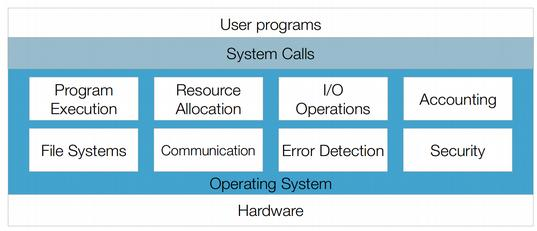

# CS241 Operating Systems Lecture 1
*4/10/18*

### What is an operating system?
> An operating system is the intermediary between the user of a computer and the
computer hardware.

### Different views of OS

**Resource Allocator**

The OS is responsible for allocating resources to all running processes.

Resources include:
* CPU time
* Memory
* I/O devices
* FIle Storage

This view is used for things like desktop workstations

**Control Program**

The OS manages the execution of user programs in order to prevent errors and improper use, especially with the operation and control of I/O devices.

This view is used for scientific instruments or machine tools

### Operating System Services
Operating System services break down into two catergories
* Those that are beneficial to the user (Program execution, I/O operations, File Systems,
Communication and Error Detection)
* Those that are beneficial to the system (Resource allocation, Accounting, Security)

### Kernel Space vs User Space
> Kernel space is where the kernel executes and provides services.

> User space is the section of memory where user processes run.

Kernel space ca be accessed via user processes through
system calls.

**System Calls** are low-level functions provided by the operating system to act as a consistent interface for common operations.

### Operating System Structures
**Simple structures**

Many operating systems started as small, simple
systems which grew beyond their original scope e.g MS-DOS and UNIX. A lot of design features are as a result of the hardware limitations at the time.

**Layered approach**

A modular design separates the OS into many layers each acting at a different level of the system.

Pros:
* Simplicity of construction
* Ease of debugging
* Clear interfaces between layers

Cons:
* Defining layers is difficult
* Layers must be carefully planned
* Efficiency - system calls access multiple
layers to execute which adds overhead

**Micro Kernels**

A microkernel is a minimal computer operating system kernel which, in its purest form, provides no operating system services at all, only the mechanisms needed to implement such services, such as low-level address space management, thread management, and inter-process communication (IPC).

Pros:
* Extending the OS is easy
* Security and reliability (services run as user)

Cons:
* Efficiency - increased system calls

**Modules**

The most current methodology for operating system design involves loadable kernel
modules.
Kernel provides core services while other services are implemented dynamically as
the kernel is running.

Pros:
* No need to rebuild the kernel to add
functionality  
* Efficient as new functionality can operate in
kernel mode

Cons:
* Need to design useful Kernel interfaces
